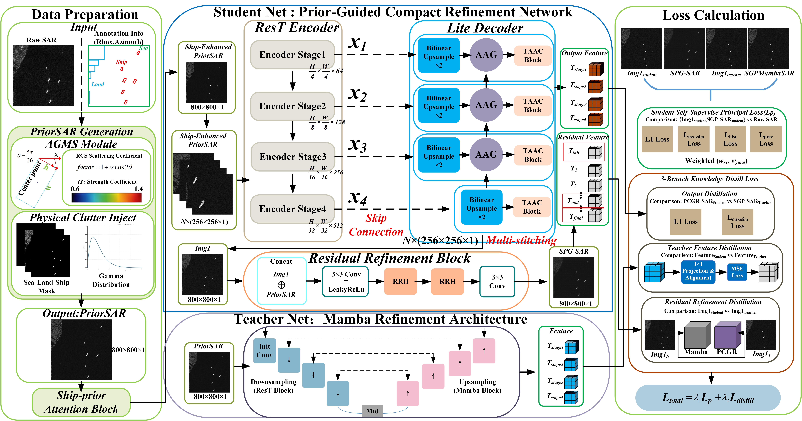
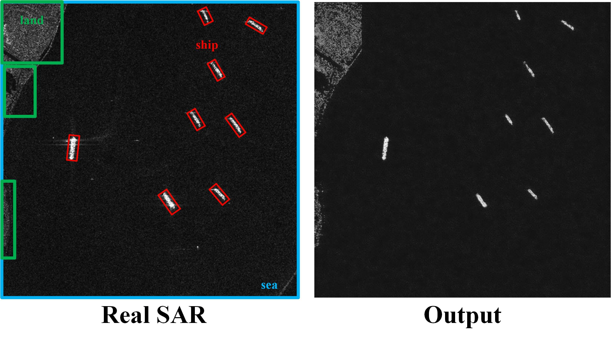
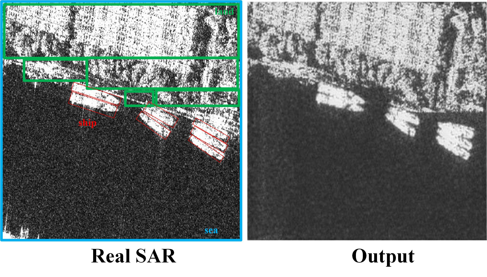
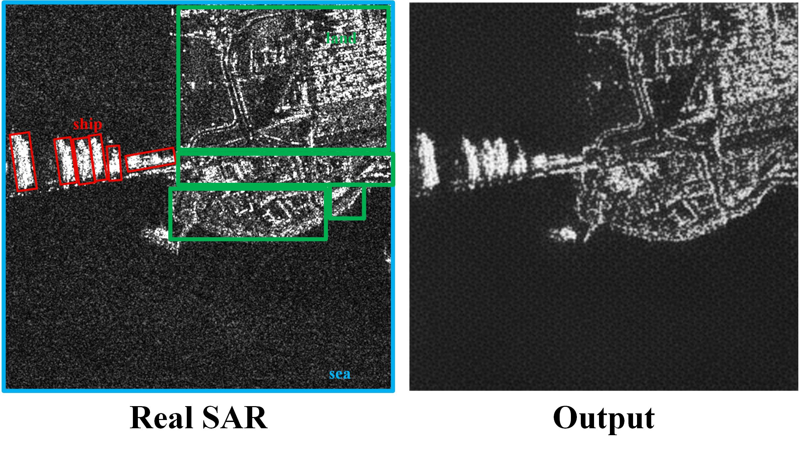

<div align="center">

# SPG-Lite

### A Scattering Prior-Guided Lightweight Model for High-Resolution SAR Ship Generation in Complex Backgrounds

<p>
  <a href="#overview">Overview</a> ·
  <a href="#results">Results</a> ·
  <a href="#preview-release">Preview release</a> ·
  <a href="#citation">Citation</a>
</p>


**Changqi Wang · Moran Ju**  
College of Information Science and Technology, Dalian Maritime University

</div>

> **Release status — paper preview.** This repository currently shares the method overview, figures, qualitative examples, annotation visualizations, and a limited number of authorized samples. Training code, inference code, configurations, pretrained weights, and complete reproduction instructions will be released after formal publication.

## Overview

Synthetic aperture radar (SAR) provides reliable observations in challenging illumination and weather conditions, but generating high-resolution ship scenes remains difficult when targets are small, densely distributed, or adjacent to complex coastlines. **SPG-Lite** addresses this problem with a compact, scattering-aware generation pipeline that retains scene structure while reducing deployment cost.

<div align="center">



*Overview of the scattering-prior-guided generation pipeline.*

</div>

### What SPG-Lite provides

| Capability | Design choice |
|---|---|
| **Controllable generation** | Builds a scattering-guided **PriorSAR** representation from sea, land, and oriented ship annotations. |
| **Ship fidelity** | Uses Ship-Prior Attention (SPA) to enhance compact and densely distributed ship responses. |
| **Complex backgrounds** | Uses Attribute-Aware Gating (AAG) and Terrain-Adaptive Asymmetric Convolution (TAAC) to preserve coastlines, port structures, and local scattering variation. |
| **Lightweight deployment** | Uses a compact PCGR reconstruction network and removes the SGPMamba teacher and distillation branches at inference time. |

## Method at a glance

1. **PriorSAR construction** — maps semantic regions and ship orientations to physically motivated relative scattering responses.
2. **PCGR reconstruction** — progressively reconstructs the SAR scene with SPA, AAG, TAAC, and residual refinement.
3. **Teacher-guided training** — transfers output-, feature-, and residual-level knowledge from SGPMamba during training only.
4. **Efficient inference** — runs the compact student model without the teacher network.

### Attribute-Aware Gate

<div align="center">


*AAG selectively transfers ship, land-boundary, and local-scattering cues through the decoder skip connection.*

</div>

### Annotation and PriorSAR construction

<div align="center">


*Example annotations and the corresponding PriorSAR representation.*

</div>

## Results

The preview figures are intended to show the problem setting and the qualitative behavior of the method. Within each comparison group, images should use the same intensity normalization and clearly identify the reference SAR image, PriorSAR input, and SPG-Lite output.

### HRSID



### SSDD



### RSDD-SAR



RSDD-SAR is included as a complex inshore stress case, with land-adjacent ships, strong coastal scattering, and densely distributed targets.

## Preview release

The preview release contains up to ten demonstration samples from each evaluation set, subject to the original dataset licenses:

```text
SPG-Lite/
├── assets/
│   ├── framework/              # Main framework, AAG, and annotation figures
│   └── results/                # Dataset-level qualitative comparisons
├── samples/
│   ├── HRSID/
│   ├── SSDD/
│   └── RSDD-SAR/
└── metadata/
    ├── sample_manifest.csv
    └── DATASET_NOTICE.md
```

For each sample, image and annotation stems must match exactly. The manifest records the source dataset, split, image size, annotation format, and redistribution status.

### Annotation convention

- **Red:** ship oriented bounding box (OBB)
- **Green:** land region or coastline boundary
- **Blue:** sea region
- **Yellow arrow:** ship azimuth

Coordinates remain in the original image coordinate system unless the sample metadata states otherwise.

## Environment

The current preview does not require the model-training stack. The listed packages support sample inspection and annotation visualization only. Full dependencies will be released with the source code.

```bash
python -m venv .venv
source .venv/bin/activate       # Linux/macOS
pip install -r requirements.txt
```

Windows PowerShell:

```powershell
.\.venv\Scripts\Activate.ps1
pip install -r requirements.txt
```

## Availability roadmap

| Material | Status |
|---|:---:|
| Method overview and framework figures | ✅ |
| Annotation visualizations | ✅ |
| Representative qualitative results | ✅ |
| Limited authorized samples | ✅ |
| Training and inference code | Planned after publication |
| PriorSAR-generation and dataset-preparation scripts | Planned after publication |
| Evaluation scripts and configurations | Planned after publication |
| Pretrained SPG-Lite weights | Planned after publication |
| Complete reproduction guide | Planned after publication |

## Dataset notice

HRSID, SSDD, and RSDD-SAR are third-party datasets. Their ownership, licenses, citation requirements, and redistribution terms remain with the original providers. Before uploading original images or annotations, verify that redistribution is permitted. If it is not permitted, publish derived visualizations, file identifiers, split lists, and instructions for obtaining the data from the official source instead.

## Citation

The repository URL and bibliographic record will be updated after publication:

```bibtex
@article{wang_spglite_2026,
  title   = {SPG-Lite: A Scattering Prior-Guided Lightweight Model for High-Resolution SAR Ship Generation in Complex Backgrounds},
  author  = {Wang, Changqi and Ju, Moran},
  journal = {To appear},
  year    = {2026}
}
```

## Contact

- Changqi Wang — `wangchangqi@dlmu.edu.cn`
- Moran Ju — `jumoran@dlmu.edu.cn`

## License

The license for the authors' original code and materials will be specified before the source-code release. Third-party datasets and derived samples remain governed by their original licenses. Do not add a permissive repository-wide license that unintentionally relicenses third-party data.

